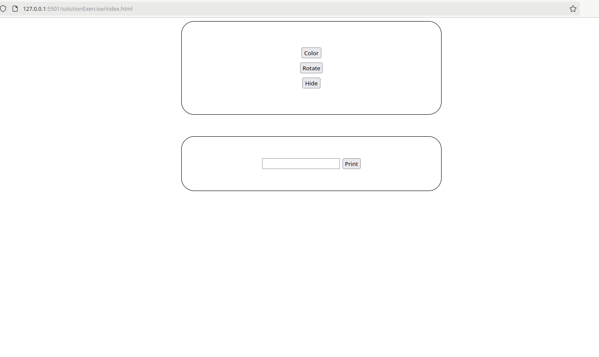

# JS Exercise

### Preparation

- Create an index.html, style.css, and script.js file
- Set up a basic HTML structure
- Link the style and script files in the HTML
- In the HTML file, there should be a box with 3 buttons arranged vertically and centered within the box
- Below this, there should be another box with an input field and a button (use only an input, not a form element)

### Task
- Each button should have functionality:
- `Color` --> the box should be colored (Challenge: try assigning a random color with each click, this can't be done using CSS class, only with element.style.backgroundColor)
- `Rotate` --> the box should rotate 360 degrees, use `transition` to see the effect
- `Hide` --> on clicking, the entire box should disappear

- The last button was not covered in the presentation, try googling them or ask me :-)
- `Print` --> the text from the input field should be displayed below. (Tipp: You can access the value of the input field using the property .value, e.g., `myInput.value` )
